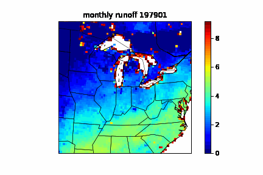

# DAWN work

a place for me to put all of my work for DAWN research

currently working on visualizations and using a tool called CDO to trim topographic climate data

here's monthly runoff from 1979-82:

